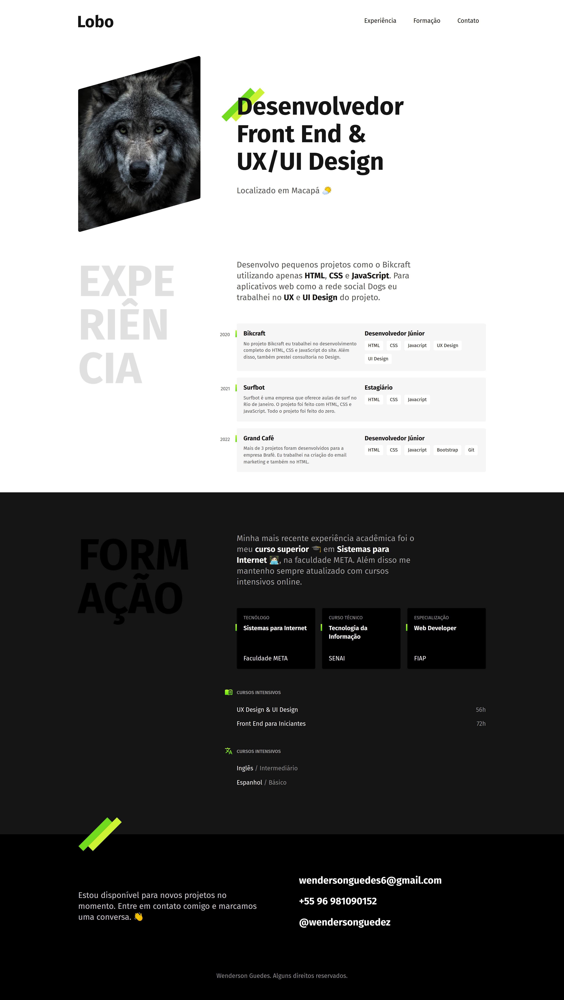

# Portfolio

#### Pequeno projeto **_front-end_** de portfolio para aplicar conhecimentos de HTML e CSS.

#### Recursos utilizados:

-   Posicionamento de elementos;
-   Responsividade através de media queries;
-   Pseudo-classes;
-   Pseudo-elementos;
-   Grid Layout;
-   HTML Semântico;

#### Resultado final:

